# Programming Assignment: Zombie Dice Project

### Table of Contents

1. [Introduction](#introduction)
2. [Gameplay](#gameplay)
3. [Input](#input)
4. [Interface](#interface)
5. [System Modeling](#system-modeling)
6. [Output](#output)
7. [Assignment Grading](#assignment-grading)
8. [Authorship and Collaboration Policy](#authorship-and-collaboration-policy)
9. [Work Submission](#work-submission)

## Introduction

In this programming assignment you must create a version of the
**Zombie Dice**&copy; to run on a terminal emulator.

The development process will require the use of Object-Oriented
Modeling with classes, random numbers generation, separate compiling, progressive programming (small
versions towards the final full-fledged program), and data structures.
You will develop the game using a software architecture based on the game-loop
design pattern. You will also learn how to implement and control an interactive user interface
running on a terminal.

## Gameplay

In Zombie Dice you and the other players are zombies (🧟) trying to collect brains
and avoid the very mean humans who are trying to blow you away with their
shotguns.
The player who has the most brains when the game ends will win.

The game is played over a series of turns following the list of players.

### Rolling the dice in a turn

At the beginning of a turn you draw three random dice from the **bag of dice** and roll them.

Each die represents a human and there are three possible colors.
The green dice (🟩) are weak humans, yellow (🟨) are tougher, and red (🟥) are the strongest humans.
Initially, the bag of dice has 13 dice: 6 greens, 4 yellows, and 3 reds.

Each die has sides made up of symbols representing
**brains** (🧠), **shotguns** (💥), and **footprints** (👣).

* Rolling a brain means you ate your victim's brain, which is good; the
number of brains you rolled are added to the _brain storage area_ (BSA).

* If you rolled a shotgun it means your victim fought back, and you didn't get
their brain; the number of shotguns rolled are added to the _shotgun storage area_ (SSA).

* Footprints mean your victim escaped. This isn't good but at least they didn't
shoot you with a shotgun; any footprints rolled are kept in the _dice rolling area_ (DRA).

After rolling the dice and sorting them into their corresponding storage areas,
we end up with one of two possible outcomes:

1. You have three or more shotguns in the STA, which means
you're severely wounded. Your turn immediately ends, and you'll score no points.
Then all the dice from the storage areas are returned into the bag.
Now the turn passes to the next person in the list of players.

2. You have less than three of these shotgun symbols.
You now get to make a choice: (a) stop and score or (b) continue rolling.

### (a) Voluntary stopping and scoring

If you decide to stop the brains in the BSA are permanently
added to your points in the **scoreboard**.
After stopping and scoring your turn ends.
All the dice from the storage areas go back into the bag, and
the turn is passed on to the next player in the list.

### (b) Continue rolling

Before you continue to roll, the game must make sure that you always have 3 dice in
the DRA to roll.
If the number of dice in the DRA
is not enough the game gets
as many new dice as necessary from the bag to complete 3 dice in the DRA.
Remember that only the footprints dice from previous roll must remain in the DRA;
the other dice (brains and shotguns) must remain in their respective storage areas.

After a new roll, the game repeats the previous steps to sort the newly rolled dice.
Recall, however, that anytime you get 3 or more shotguns you score no brains and all the
three storage areas are cleared for the next player.

### Types of dice and the bag of dice

As stated previously, there are three types of dice, each with distinct face configuration, as follows:

1) The green die (🟩): it represents weak humans because it has 3 sides with brains, 1 side with
a shotgun, and 4 sides with footprints.

2) The yellow die (🟨): it represents tougher humans because it has 2 sides with brains, 2 sides
with shotguns, and 4 sides with footprints.

3) The red die (🟥): it represents the strongest humans because it has 1 side with brain, 
3 sides with shotguns, and 4 sides with footprints.

Hence, each type of die yields different probability of rolling brains.
The bag of dice has 13 dice in total, 6 green, 4 yellow, and 3 red.

Before deciding whether to keep rolling or not the player should consider 
(1) how many brains the play has already rolled, and
(2) the colors of the dice on the table (i.e. in the BSA, SSA, and DRA) and in the bag, where any new dice would be randomly drawn from.

The player, however, cannot explicitly see which types of dice are still in the bag.
Of course, it's possible to deduce that information based on the dice already outside the bag.

In case the player ever wants to roll again and the number of dice in the bag is not
enough to complete the required 3 dice in the DRA, all the dice from the BSA must return to the
bag (the shotguns dice, though, must remain put in the SSA) . Of course, the player gets to keep the number of brains already rolled, so long s/he
does not die during the next rolling actions.
<!-- The shotguns dice, though, must remain put in the SSA. -->
After returning these dice to the bag, the player may keep rolling as usual, if s/he wishes so.
Any new brains rolled are added to the player's previous total.
Similarly, any new shotguns are added to the SSA.

### Game over

The players may continue rolling or stopping like described above until 
someone has at least 13 brains in their scored board.
When this happens, the game keeps playing until everyone 
has had an even number of turns.

This means that the game does not just end as soon as some player
gets to 13+ brains.
All the other player must complete their rounds so that at the
end all have played equal amount of turns.

For instance, suppose we have 3 players in the list.
If the Player #1 gets, say, 14 brains by the end of his 5th turn,
the game must continue for Player #2, and #3 until they both also
complete 5 turns like Player #1.
At this point, the game must indicate that the winner is whoever 
got more brains, which does not necessary mean the Player #1.

### Breaking a tie

Because the game must allow all players to finish their turn before
declaring the winner, it is possible that when the last player finishes his final turn,
two or more players have the same amount of 13+ brains.
In this case we have a tie.
Then the tied players, and only those players, must play as many equal
extra turns as necessary to break the tie.

## Input

The primary data input for the program is the list of players identified by their names.
This information should be entered soon after the program is run and before the game starts.

Alternatively, you may consider implementing a parser for [INI](https://en.wikipedia.org/wiki/INI_file) 
configuration file. 
This allows the creation of a `zdice.ini` configuration file in which we may set important 
configuration aspects of the game such as:

* The minimal number of brains to win, which is 13 by default.
* The number of faces and the configuration for the 3 types of dice.
* The quantity of each of the three types of dice in the bag.
* The max quantity of players.

Here is an example of a configuration file for the game:

```ini
[Game]
weak_dice = 6
strong_dice = 4
tough_dice = 3
max_players = 6
brains_to_win = 13

[Dice]
weak_die_faces   = "bbbffs"
strong_die_faces = "bbffss"
tough_die_faces  = "bffsss"

```
In case you decide to support the configuration file, you program should receive the path
to the configuration file via Command Line Arguments.
For instance:

```bash
./zdice zdice.ini
```

If no file is passed to the program or the config file provided is not found, your program should
assume the default values defined in this document.

## Interface

### The Welcome screen

Running `zdice` will display the welcome screen and ask the user how many players want to play.
After that input is validated (max of 5 players, by default), the game proceeds to ask the user to enter
all the names for each player.

Next, the game must shuffle the player list and indicate which player should start the turn.
The shuffled sequence of player will be displayed to the user in the action game screen next.

```
$ ./zdice

         ---> Welcome to the Zombi Dice game (v 0.1) <--
                   -copyright DIMAp/UFRN 2024-

  The object of the jeopardy dice game Zombie Dice is to be the
  first to eat 13 or more human brains in a turn.
  Each player's turn consists of repeatedly rolling 3 dice.
  A die may produce 3 outcomes: you ate a brain, the human escaped,
  or you were shot!
  If you get shot 3 or more times you die and loose all brains you
  ate in that turn; then the turn goes to the next player.
  However, if you decide to stop before get shot 3 times, you keep
  the brains you ate.

  >>> How many players? (min 2, max 6)
  3

  >>> Enter the names of the 3 players, separated by comma (ex.: player #1, player #2, etc.):
  Carvalho,  Vinicius,  Marina

  >>> The player who will start the game is "Marina"
  Press <Enter> to start the match.
```

### The Playing screen

The  play screen may follow the organization below.

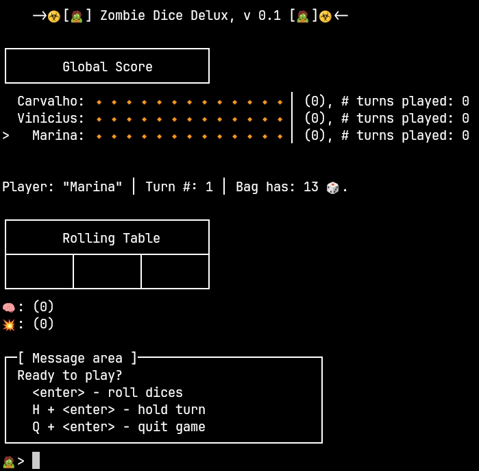

The screen has 5 different regions:
* The title of the game.


* The scoreboard area, which keeps track of how many brains each play has eaten, shows
who is the current player (prefix `>`), and how many turns were played.

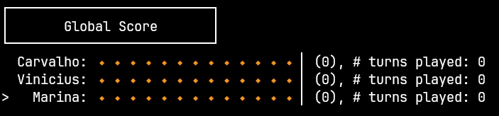

* The Dice Rolling Area (DRA) is the table with 3 cells, the Brain Storage Area (BRA) just
below the DRA, and the Shotgun Storage Area (SSA), just below the BRA.

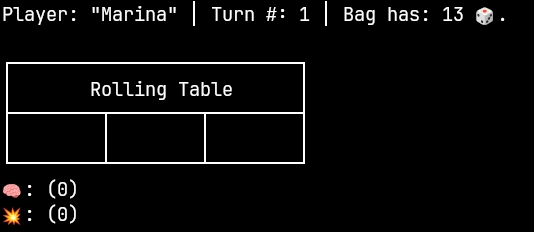

* The message area, which displays proper instructions for the player based on the current game situation.

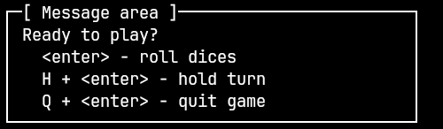

* The prompt, where the player should enter his/her command.

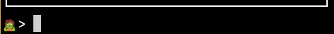

The next screenshots demonstrate one player rolling the dice 3 times, then deciding
to hold and keep the brains she ate.

| Screenshots | Description |
| ------------- | ------------- |
| 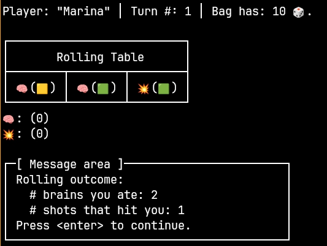 | Marina requested dice roll. Got 2 brains and 1 shotgun. |
| 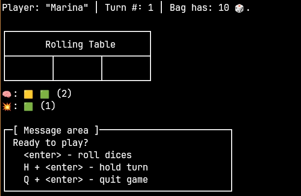 | All dice have been sorted to either the BSA or SSA. In this situation we need to get 3 new dice from the bag. Now the player has to choose what to do next. |
| 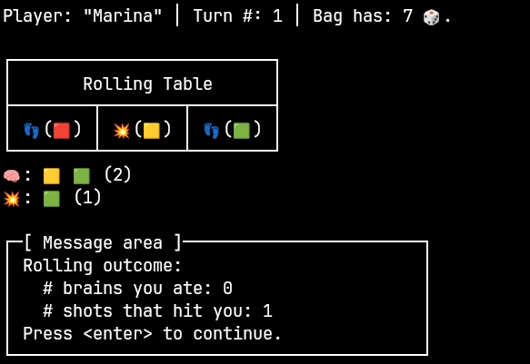 | Rolled dice again. In this situation we will need on extra die from the bag. |
| 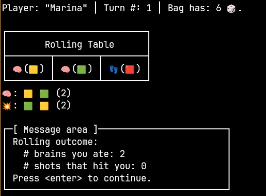 | Dice sorted to their areas; asked to roll again. |
| 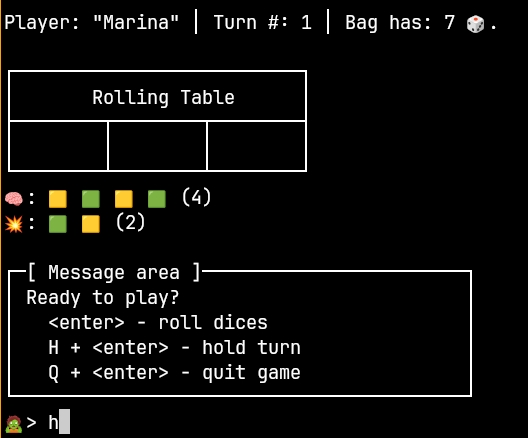 | Dice sorted to their areas; choosing to hold. |
| 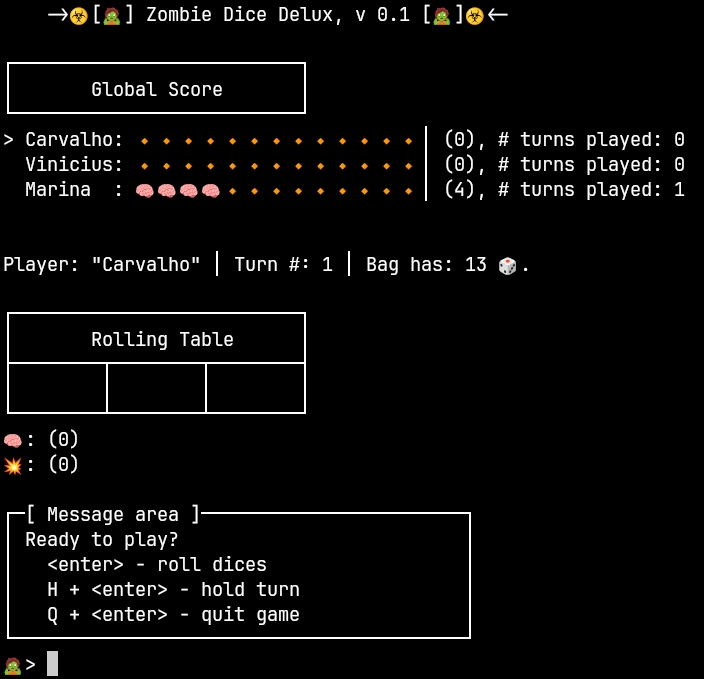 | Main play screen, showing the global score after 1 turn concluded. All brains the player ate were added to the global scoreboard. Next player is shown with the prefix `>`: Carvalho.|


## System Modeling

The first step is to identify which **entities** might help you model the problem.
The second step is to design the Finite State Machine that represents all the possible
transitions in the game.
Then for each state you will have to decide what to read (`process_events()`),
what must change (`update()`), and what to show (`render()`) in each state. 
Here goes some suggestions of entities involved in the problem.

### The `ZDie`

This entity represents a die in the game.
Its responsibility is to allow the client to define the number of faces and their values, the type of die (green, yellow, or red) as well
as to roll the die and yield a random face back to the client.

All the faces should have the same probability of been selected, i.e. an uniform distribution.

### The `Player`

This entity represents a single player.
The class is primarily responsible for keeping the player's name, and how many brains s/he has eaten so far.
Feel free to add other attributes or responsibilities to this class, such how
many turns have been played, or even some player state, such as `hungry`, at the beginning of a turn,
 and `satiated`, when the player has eaten enough brains to win.

### The `DiceBag`

This entity is responsible for storing the dice and providing methods to
randomly draw 3 dice and occasionally receive some dice back for future draw. 
It should also offer method for shuffle the bag, and possible some common access 
method to inform, for instance, how many dice are still inside the bag.

### The `GameController`

This entity represents the game manager and is the most important class in this suggested modeling scheme.
The `GameController` is responsible for implementing the [Game-Loop architecture](https://gameprogrammingpatterns.com/game-loop.html) to control the game flow.
It is also the entity that "owns" the list of players, the dice bag, etc.

It is also responsibility of this class to keep the overall score, manage turns, resolve ties,
and inform who is the winner of the game.

## Output

The output of the program is the sequence of screens showing the game state as the game progresses.

Note that it is no necessary to worry about clearing the screen. Just send the text to the
standard output and this will naturally roll the screens up in the terminal.

To have the best user interface experience while playing, try to resize the terminal window 
where the game is running so that it fits perfectly the main playing screen.

### Error Management

There are just a few situations that may cause an error while playing the game.
Here is non-exhaustive list of such error situations:

* Providing a configuration file that does not exist. In this case the game assume default values.

* If your program reads any configuration file, it must be validated. Any invalid fields may be ignored.

* The user types in an invalid command while playing. You may ignore invalid commands or print 
a warning message in the Message area of the interface.

* User entering less or more player names than, respectively, the minimum and maximum allowed. In this case you may
ignore any name beyond the maximum. If you have too few names, you have to ask the user to provide
the minimum number of player names to continue.


## Assignment Grading

This assignment has a total of **120 points**. Bellow is a table with the description of the item under consideration and the assigned grade _if the item is totally correct_. Partial grade will be considered if the item is not fully correct.

| Item                                      | Value (points) |
| ----------------------------------------- | :------------: |
| The project contains at least 2 classes   |       7        |
| Show help as requested `-h`               |       4        |
| Read player names                         |       10       |
| Show all 5 regions in user interface      |       12       |
| Keeps overall scores                      |       5        |
| Keeps bag of dice consistent              |       5        |
| Handles automatic turn hand over          |       5        |
| Handles hold requests                     |       5        |
| Handles roll requests                     |       5        |
| Handles ties                              |       12       |
| Move brains dice back to bag when needed  |       10       |
| Manages turns correctly                   |       5        |
| Reads configuration file                  |       15       |
| Handles user errors                       |       5        |
| Show winner correctly                     |       5        |
| Program working fine                      |       10       |

The following situations may take credits out of your assignment, if they happen during the evaluation process:

| Item                                              | Value (points) |
| ------------------------------------------------- | :------------: |
| Compiling and/or runtime errors                   |       -5       |
| Missing code documentation in Doxygen style       |      -10       |
| Memory leak                                       |      -10       |
| [`author.md`](docs/author.md) file not filled out |      -10       |
| Program crashes while testing                     |       -5       |

The [`author.md`](docs/author.md) file should contain a brief description of the project, and how to run it. It also should describe possible errors, limitations, or issues found. Do not forget to include the author name!

# Authorship and Collaboration Policy

This is a pair assignment. You may work in a pair or alone. If you work as a pair, comment both members' names atop every code file, and try to balance evenly the workload.

Any team may be called for an interview. The purpose of the interview is twofold: to confirm the authorship of the assignment and to identify the workload assign to each member. During the interview, any team member should be capable of explaining any piece of code, even if he or she has not written that particular piece of code. After the interview, the assignment's credits may be re-distributed to better reflect the true contribution of each team member.

The cooperation among students is strongly encouraged. It is accepted the open discussion of ideas or development strategies. Notice, however, that this type of interaction should not be understood as a free permission to copy and use somebody else's code. This is may be interpreted as plagiarism.

Any two (or more) programs deemed as plagiarism will automatically receive **zero** credits, regardless of the real authorship of the programs involved in the case. If your project uses a (small) piece of code from someone else's, please provide proper acknowledgment in the README file.

# Work Submission

Both team members must submit a single zip file containing the entire project via SIGAA before the deadline. This should be done only via the proper link in the SIGAA's virtual class.
**Submission via email shall be ignored!**

The same project must, also, be commited before the same deadline to the proper GitHub repository created by the GitHub Classroom assignment.

Any commits made after the deadline will make your project be evaluated as a **later submission**. This means that your project's grade will probably be reduced, even if the project is completely correct.

Remember to remove all the executable files (i.e. the `build` folder) from your project before handing in your work.

---

&copy; DIMAp/UFRN 2024.
